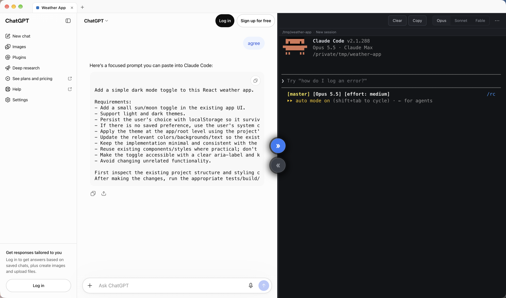

# Avva Mobile Sidekick

Plan with ChatGPT. Build with Claude Code. Stop copy-pasting between them.



Sidekick is a desktop app for macOS and Windows that puts a ChatGPT conversation and a Claude Code terminal side by side, one pair per project. You think out loud with ChatGPT (by voice or text). When the plan is ready, ChatGPT writes a prompt for Claude, and one click hands it to Claude Code in your project folder. When Claude finishes, one more click sends a summary of what changed back to ChatGPT for review.

You decide every handoff. Nothing moves between ChatGPT and Claude unless you ask for it.

## How it works

```
 ┌─────────────── ChatGPT ───────────────┐   ┌──────────── Claude Code ────────────┐
 │ 1. You plan the change with ChatGPT.  │   │                                     │
 │ 2. ChatGPT writes a prompt for Claude.│──▶│ 3. Send to Claude: the prompt is    │
 │                                       │   │    pasted into Claude Code, which   │
 │                                       │   │    works in your project folder.    │
 │ 5. ChatGPT reviews the result and you │◀──│ 4. Send to ChatGPT: Claude's result │
 │    decide what happens next.          │   │    and a Git summary go back.       │
 └───────────────────────────────────────┘   └─────────────────────────────────────┘
```

- **Projects as tabs.** Each project has its own ChatGPT conversation, its own Claude Code session and its own folder. Switching tabs never mixes their context.
- **One-click handoffs.** Two round buttons on the divider: *Send to Claude* lights up when ChatGPT has written a Claude prompt; *Send to ChatGPT* appears when Claude has finished.
- **Your Claude Code, unchanged.** The right-hand pane is the real interactive `claude` terminal with your own settings, model, permissions and status line. You can type into it as usual.
- **Notifications.** A badge, toast and system notification tell you when Claude finishes in a project you are not looking at.
- **Voice-friendly.** ChatGPT's voice mode works inside the app. Saying "send this to Claude" in your own message lets Sidekick send the next prompt after a 3-second countdown you can cancel (can be turned off in Settings).

## Install

Download the latest installer from [Releases](https://github.com/AvvaMobile/AvvaMobile.Sidekick/releases):

- **macOS** (Apple silicon or Intel): `Avva-Mobile-Sidekick-<version>-arm64.dmg` or `-x64.dmg`
- **Windows** (x64): `Avva-Mobile-Sidekick-Setup-<version>.exe` (installs for your user only, no admin rights needed)

On first launch, a *Before you start* window checks your computer for what Sidekick needs and links to anything that is missing:

| Requirement | Why |
| --- | --- |
| [Claude Code](https://code.claude.com/docs/en/setup), installed and signed in | Writes the code in your project folder |
| A ChatGPT account | You sign in once inside the app |
| [Git](https://git-scm.com/downloads) | Summarizes what Claude changed |
| Microphone permission (optional) | ChatGPT voice mode |

You can reopen this window any time from **Help → Setup Checklist…**.

> **macOS builds are signed with Avva Mobile's Developer ID and notarized by Apple**, so they open without warnings and update themselves. **Windows builds are not code-signed yet**: SmartScreen shows "unknown publisher"; choose **More info → Run anyway**.

## Security and privacy

> [!IMPORTANT]
> **Security first.** Sidekick sits between a website (ChatGPT) and a tool that can change files on your computer (Claude Code). It is built so that **the website can never reach your computer**, and **nothing crosses between the two without you**.

### ChatGPT runs in a locked-down browser view

- The ChatGPT page runs in a sandboxed Chromium view with no Node.js access, context isolation on and **no bridge of any kind** to the app. It cannot read or write files, start processes, run Git or Claude, or call into Sidekick.
- It can only navigate to ChatGPT, OpenAI sign-in and the sign-in providers ChatGPT offers (Google, Apple, Microsoft). Any other link opens in your normal browser after the URL is checked.
- Downloads, USB/HID/serial/Bluetooth access and screen capture requests from the page are refused.
- The microphone is granted only to ChatGPT's own pages, only in the main frame, and only for audio. Sidekick never asks for it on its own at startup: on macOS the system asks once, when you click **Allow** in the setup window; on Windows, Windows' own microphone privacy setting applies.

### Claude only runs when you say so

- Text written by ChatGPT is treated as data. It never starts Claude by itself.
- Claude receives a prompt only when you click **Send to Claude**, or when your own ChatGPT message explicitly asks for it ("send this to Claude"). That automatic send waits 3 seconds with a **Cancel** button, never fires twice for the same message, and can be turned off.
- The prompt is cleaned of control characters before it is pasted, so text in a ChatGPT reply cannot type extra keys into Claude.
- A prompt that has already run successfully cannot be sent again by another click.
- Claude Code runs as your normal interactive session with **your own permission settings**. Sidekick never passes flags that skip Claude's permission prompts. Quitting while Claude is working asks for confirmation first.

### What is sent back to ChatGPT, and when

Only when you click **Send to ChatGPT**, Sidekick posts a bounded review message into that project's ChatGPT conversation. It contains:

- an excerpt of the prompt and Claude's final answer,
- the Git branch, changed file names, diff statistics and a size-limited diff excerpt.

Files that look like secrets are left out of the diff: `.env` files, keys and certificates (`*.pem`, `*.key`, `*.p12`, `*.pfx`, SSH keys), anything named `*secret*` or `*credential*`, and lock files. The full Claude transcript is never sent.

Keep in mind that the diff excerpt is your source code going to ChatGPT. If a project's code must not leave your machine, do not use *Send to ChatGPT* for it.

### Your accounts and credentials

- Sidekick never sees your ChatGPT password. You sign in on OpenAI's own page; the session cookie stays in the app's local Chromium profile, like in a browser.
- Claude Code keeps its own login. Sidekick never reads Claude's credentials; it only reads your default model name from `~/.claude/settings.json` to show it in Settings.
- Sidekick has no account, no server and no API keys of its own.

### Network and telemetry

Sidekick itself makes exactly one kind of network request: checking this repository's GitHub Releases for updates (installed app only). Everything else on the network is the ChatGPT page you are using and Claude Code doing its own work. **No analytics, no telemetry, no crash reporting.**

### Data on your computer

| What | Where |
| --- | --- |
| Projects, layout, task history, settings | macOS: `~/Library/Application Support/AvvaMobile.Sidekick/` · Windows: `%APPDATA%\AvvaMobile.Sidekick\` |
| ChatGPT sign-in (cookies) | Same folder, in the app's Chromium profile |
| Diagnostics log (app events, URLs with query strings removed) | `…/AvvaMobile.Sidekick/diagnostics/events.log`, never uploaded |

Deleting that folder resets the app and signs you out of ChatGPT inside it. Your project folders are never touched by Sidekick itself; only Claude Code changes files, under its own permissions.

### Updates

Installed apps check for a new version on launch and every 4 hours, download it in the background and ask before restarting. Updates come only from this repository's GitHub Releases, built by the public [release workflow](.github/workflows/release.yml) from tagged source. The packaged app has Electron's Node.js and debugger entry points switched off (Electron fuses), so it cannot be run as a plain Node.js runtime.

### Reporting a vulnerability

Please report security issues privately through GitHub: **Security → Report a vulnerability** on this repository. Do not open a public issue for them. Details, supported versions and scope: [.github/SECURITY.md](.github/SECURITY.md).

## Limitations

- ChatGPT's page changes often. If *Send to Claude* stays disabled while a prompt is visible, the prompt detection needs an update.
- Windows support is new and has had little real-world testing.
- Windows builds are not yet code-signed (see [Install](#install)).

## Development

```sh
npm install
npm run app        # build and launch (macOS dev bundle with the product name and icon)
npm test           # unit tests
npm run typecheck
npm run dist:mac   # local macOS build into dist/
npm run dist:win   # local Windows build into dist/
```

Requires Node.js 22.12 or later. Release steps: [docs/RELEASING.md](docs/RELEASING.md). Architecture, workflow and security requirements: [docs/ARCHITECTURE.md](docs/ARCHITECTURE.md), [docs/WORKFLOW.md](docs/WORKFLOW.md), [docs/SECURITY.md](docs/SECURITY.md). Decisions are recorded in [docs/DECISIONS.md](docs/DECISIONS.md).

## License

[MIT](LICENSE) © 2026 Avva Mobile
